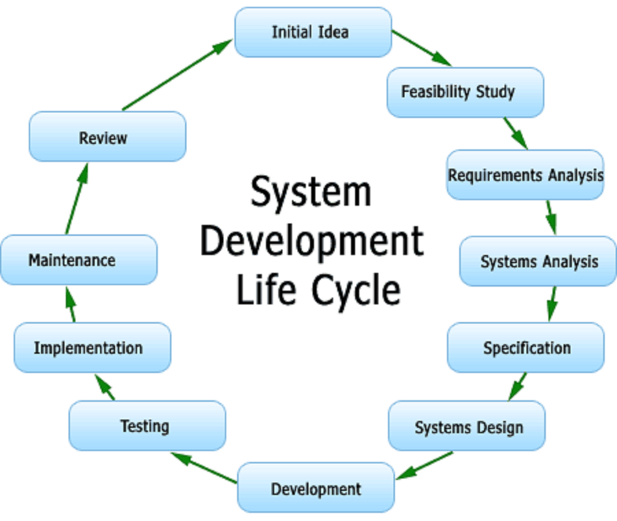

> How to prepare system design questions for an IT company

System design is a very broad topic. Even a software engineer with many years of working experience at a top IT company may not be an expert on system design. If you want to become an expert, you need to read many books, articles, and solve real large scale system design problems.

This repository only teaches you how to handle the system design interview with a systematic approach in a short time. You can dive into each topic if you have time. Of course, welcome to add your thoughts!

## <a name='toc'>Table of Contents</a>
- [ ] [System Design Interview Tips](#tips)
- [ ] [Basic Knowledge about System Design](#intro)
- [ ] [Company Engineering Blogs](#blog)
- [ ] [Products and Systems](#system)
- [ ] [Hot Questions and Reference](#qs)
- [ ] [Good Books](#bk)
- [ ] [Object Oriented Design](#ood)

### [[⬆]](#toc) <a name='tips'>System Design Interview Tips:</a>

**Clarify the constraints and identify the user cases**

Spend a few minutes questioning the interviewer and agreeing on the scope of the system.
Remember to make sure you know all the requirements the interviewer didn't tell you about in the beginning.

User cases indicate the main functions of the system, and constraints list the scale of the system such as requests 
per second, requests types, data written per second, data read per second.

**High-level architecture design**

Sketch the important components and the connections between them, but don't go into some details. 
Usually, a scalable system includes webserver (load balancer), service (service partition), database (primary/secondary database cluster plug cache).
 
**Component design**

For each component, you need to write the specific APIs for each component. You may need to finish
the detailed OOD design for a particular function. You may also need to design the database schema for the database.

### [[⬆]](#toc) <a name='intro'>Basic Knowledge about System Design:</a>

Here are some articles about system design related topics.  

* [How to Rock a Systems Design Interview](http://www.palantir.com/2011/10/how-to-rock-a-systems-design-interview/)
* [System Interview](http://www.hiredintech.com/app#system-design)
* [Scalability for Dummies](http://www.lecloud.net/tagged/scalability)
* [Scalable Web Architecture and Distributed Systems](http://www.aosabook.org/en/distsys.html)
* [Numbers Everyone Should Know](http://everythingisdata.wordpress.com/2009/10/17/numbers-everyone-should-know/)
* [Fallacies of distributed systems](https://pages.cs.wisc.edu/~zuyu/files/fallacies.pdf)
* [Scalable System Design Patterns](http://horicky.blogspot.com/2010/10/scalable-system-design-patterns.html)
* [Introduction to Architecting Systems for Scale](http://lethain.com/introduction-to-architecting-systems-for-scale/)
* [Transactions Across Datacenters](http://snarfed.org/transactions_across_datacenters_io.html)
* [A Plain English Introduction to CAP Theorem](http://ksat.me/a-plain-english-introduction-to-cap-theorem/)
* [The CAP FAQ](https://github.com/henryr/cap-faq)
* [Paxos Made Simple](http://research.microsoft.com/en-us/um/people/lamport/pubs/paxos-simple.pdf)
* [Consistent Hashing](http://www.tom-e-white.com/2007/11/consistent-hashing.html)
* [NOSQL Patterns](http://horicky.blogspot.com/2009/11/nosql-patterns.html)
* [Scalability, Availability & Stability Patterns](http://www.slideshare.net/jboner/scalability-availability-stability-patterns)

Of course, if you want to dive into system related topics, here is a good collection of reading list about [services-engineering](https://github.com/mmcgrana/services-engineering), and
a good collection of material about [distributed systems](http://dancres.github.io/Pages/).

### [[⬆]](#toc) <a name='blog'>Company Engineering Blogs:</a>

If you are going to have an onsite with a company, you should read their engineering blog. 

* [High Scalability](http://highscalability.com/)
* [The GitHub Blog](https://github.com/blog/category/engineering)
* [Engineering at Quora](http://engineering.quora.com/)
* [Yelp Engineering Blog](http://engineeringblog.yelp.com/)
* [Twitter Engineering](https://engineering.twitter.com/)
* [Facebook Engineering](https://www.facebook.com/Engineering)
* [Yammer Engineering](http://eng.yammer.com/blog/)
* [Etsy Code as Craft](http://codeascraft.com/)
* [Foursquare Engineering Blog](http://engineering.foursquare.com/)
* [Airbnb Engineering](http://nerds.airbnb.com/)
* [WebEngage Engineering Blog](http://engineering.webengage.com/)
* [LinkedIn Engineering](http://engineering.linkedin.com/blog)
* [The Netflix Tech Blog](http://techblog.netflix.com/)
* [BankSimple Simple Blog](https://www.simple.com/engineering/)
* [Square The Corner](http://corner.squareup.com/)
* [SoundCloud Backstage Blog](https://developers.soundcloud.com/blog/)
* [Flickr Code](http://code.flickr.net/)
* [Instagram Engineering](http://instagram-engineering.tumblr.com/)
* [Dropbox Tech Blog](https://tech.dropbox.com/)
* [Cloudera Developer Blog](http://blog.cloudera.com/)
* [Bandcamp Tech](http://bandcamptech.wordpress.com/)
* [Oyster Tech Blog](http://tech.oyster.com/)
* [THE REDDIT BLOG](http://www.redditblog.com/)
* [Groupon Engineering Blog](https://engineering.groupon.com/)
* [Songkick Technology Blog](http://devblog.songkick.com/)
* [Google Research Blog](http://googleresearch.blogspot.com/)
* [Pinterest Engineering Blog](http://engineering.pinterest.com/)
* [Twilio Engineering Blog](http://www.twilio.com/engineering)
* [Bitly Engineering Blog](http://word.bitly.com/)
* [Uber Engineering Blog ](https://eng.uber.com/)
* [Godaddy Engineering](http://engineering.godaddy.com/)
* [Splunk Blog](http://blogs.splunk.com/)
* [Coursera Engineering Blog](https://building.coursera.org/)
* [PayPal Engineering Blog](https://www.paypal-engineering.com/)
* [Nextdoor Engineering Blog](https://engblog.nextdoor.com/)
* [Booking.com Development Blog](https://blog.booking.com/)
* [Scalyr Engineering Blog ](https://blog.scalyr.com/)

### [[⬆]](#toc) <a name='system'>Products and Systems:</a>

The following papers/articles/slides can help you to understand the general design idea of different real products and systems. 

* [MapReduce: Simplied Data Processing on Large Clusters](http://static.googleusercontent.com/media/research.google.com/zh-CN/us/archive/mapreduce-osdi04.pdf)
* [Bigtable: A Distributed Storage System for Structured Data](http://www.read.seas.harvard.edu/~kohler/class/cs239-w08/chang06bigtable.pdf)
* [The Google File System](http://static.googleusercontent.com/media/research.google.com/zh-CN/us/archive/gfs-sosp2003.pdf)
* [The Chubby lock service for loosely-coupled distributed systems](http://static.googleusercontent.com/external_content/untrusted_dlcp/research.google.com/en/us/archive/chubby-osdi06.pdf)
* [Dynamo: Amazon's Highly Available Key-value Store](http://www.read.seas.harvard.edu/~kohler/class/cs239-w08/decandia07dynamo.pdf)
* [Introduction to Memcached](http://www.slideshare.net/oemebamo/introduction-to-memcached)
* [Cassandra Introduction Features](http://www.slideshare.net/planetcassandra/cassandra-introduction-features-30103666)
* [Introduction to HBase](http://www.slideshare.net/alexbaranau/intro-to-hbase)
* [Introduction to MongoDB](http://www.slideshare.net/mdirolf/introduction-to-mongodb)
* [Introduction to Redis](http://www.slideshare.net/dvirsky/introduction-to-redis)
* [Storm](http://www.slideshare.net/previa/storm-16094009)
* [Introduction to Zookeeper](http://www.slideshare.net/sauravhaloi/introduction-to-apache-zookeeper)
* [Kafka](http://www.slideshare.net/mumrah/kafka-talk-tri-hug)
* [YouTube Architecture](http://highscalability.com/youtube-architecture)
* [Scaling Pinterest](http://highscalability.com/blog/2013/4/15/scaling-pinterest-from-0-to-10s-of-billions-of-page-views-a.html)
* [Google Architecture](http://highscalability.com/google-architecture)
* [Scaling Twitter](http://highscalability.com/scaling-twitter-making-twitter-10000-percent-faster)
* [The WhatsApp Architecture](http://highscalability.com/blog/2014/2/26/the-whatsapp-architecture-facebook-bought-for-19-billion.html)
* [Flickr Architecture](http://highscalability.com/flickr-architecture)
* [Amazon Architecture](http://highscalability.com/amazon-architecture)
* [Stack Overflow Architecture](http://highscalability.com/blog/2009/8/5/stack-overflow-architecture.html)
* [Pinterest Architecture](http://highscalability.com/blog/2012/5/21/pinterest-architecture-update-18-million-visitors-10x-growth.html)
* [Tumblr Architecture](http://highscalability.com/blog/2012/2/13/tumblr-architecture-15-billion-page-views-a-month-and-harder.html)
* [Instagram Architecture](http://highscalability.com/blog/2011/12/6/instagram-architecture-14-million-users-terabytes-of-photos.html)
* [TripAdvisor Architecture](http://highscalability.com/blog/2011/6/27/tripadvisor-architecture-40m-visitors-200m-dynamic-page-view.html)
* [Scaling Mailbox](http://highscalability.com/blog/2013/6/18/scaling-mailbox-from-0-to-one-million-users-in-6-weeks-and-1.html)
* [Salesforce Architecture ](http://highscalability.com/blog/2013/9/23/salesforce-architecture-how-they-handle-13-billion-transacti.html)
* [ESPN Architecture](http://highscalability.com/blog/2013/11/4/espns-architecture-at-scale-operating-at-100000-duh-nuh-nuhs.html)
* [Uber Architecture](http://highscalability.com/blog/2015/9/14/how-uber-scales-their-real-time-market-platform.html)
* [DropBox Design](https://www.youtube.com/watch?v=PE4gwstWhmc)
* [Splunk Architecture](http://www.splunk.com/view/SP-CAAABF9)

### [[⬆]](#toc) <a name='qs'>Hot Questions and Reference:</a>

There are some good references for each question. The references here are slides and articles. 

**Design a CDN network**  
Reference:  
* [Globally Distributed Content Delivery](http://repository.cmu.edu/cgi/viewcontent.cgi?article=2112&context=compsci)

**Design a Google document system**  
Reference:  
* [google-mobwrite](https://code.google.com/p/google-mobwrite/)
* [Differential Synchronization](https://neil.fraser.name/writing/sync/)

**Design a random ID generation system**  
Reference: 
* [Announcing Snowflake](https://blog.twitter.com/2010/announcing-snowflake) 
* [snowflake](https://github.com/twitter/snowflake/)

**Design a key-value database**  
Reference:   
* [Introduction to Redis](http://www.slideshare.net/dvirsky/introduction-to-redis)

**Design the Facebook news feed function**   
Reference:   
* [What are best practices for building something like a News Feed?](http://www.quora.com/What-are-best-practices-for-building-something-like-a-News-Feed) 
* [What are the scaling issues to keep in mind while developing a social network feed?](http://www.quora.com/Activity-Streams/What-are-the-scaling-issues-to-keep-in-mind-while-developing-a-social-network-feed) 
* [Activity Feeds Architecture](http://www.slideshare.net/danmckinley/etsy-activity-feeds-architecture)

**Design the Facebook timeline function**   
Reference: 
* [Building Timeline](https://www.facebook.com/note.php?note_id=10150468255628920) 
* [Facebook Timeline](http://highscalability.com/blog/2012/1/23/facebook-timeline-brought-to-you-by-the-power-of-denormaliza.html)

**Design a function to return the top k requests during past time interval**   
Reference:  
* [Efficient Computation of Frequent and Top-k Elements in Data Streams](http://www.cse.ust.hk/~raywong/comp5331/References/EfficientComputationOfFrequentAndTop-kElementsInDataStreams.pdf)
* [An Optimal Strategy for Monitoring Top-k Queries in Streaming Windows](http://davis.wpi.edu/xmdv/docs/EDBT11-diyang.pdf)

**Design an online multiplayer card game**   
Reference:  
* [How to Create an Asynchronous Multiplayer Game](http://www.indieflashblog.com/how-to-create-an-asynchronous-multiplayer-game.html)   
* [How to Create an Asynchronous Multiplayer Game Part 2: Saving the Game State to Online Database](http://www.indieflashblog.com/how-to-create-async-part2.html)  
* [How to Create an Asynchronous Multiplayer Game Part 3: Loading Games from the Database](http://www.indieflashblog.com/how-to-create-async-part3.html)  
* [How to Create an Asynchronous Multiplayer Game Part 4: Matchmaking](http://www.indieflashblog.com/how-to-create-async-part4-html.html#comment-4447)  
* [Real Time Multiplayer in HTML5](http://buildnewgames.com/real-time-multiplayer/)  

**Design a graph search function**   
Reference:   
* [Building out the infrastructure for Graph Search](https://www.facebook.com/notes/facebook-engineering/under-the-hood-building-out-the-infrastructure-for-graph-search/10151347573598920)
* [Indexing and ranking in Graph Search](https://www.facebook.com/notes/facebook-engineering/under-the-hood-indexing-and-ranking-in-graph-search/10151361720763920) 
* [The natural language interface of Graph Search](https://www.facebook.com/notes/facebook-engineering/under-the-hood-the-natural-language-interface-of-graph-search/10151432733048920) and [Erlang at Facebook](http://www.erlang-factory.com/upload/presentations/31/EugeneLetuchy-ErlangatFacebook.pdf)

**Design a picture sharing system**   
Reference:   
* [Flickr Architecture](http://highscalability.com/flickr-architecture) 
* [Instagram Architecture](http://highscalability.com/blog/2011/12/6/instagram-architecture-14-million-users-terabytes-of-photos.html)

**Design a search engine**   
Reference:  
* [How would you implement Google Search?](http://programmers.stackexchange.com/questions/38324/interview-question-how-would-you-implement-google-search)  
* [Implementing Search Engines](http://www.ardendertat.com/2012/01/11/implementing-search-engines/)

**Design a recommendation system**  
Reference:  
* [Hulu’s Recommendation System](http://tech.hulu.com/blog/2011/09/19/recommendation-system.html)  
* [Recommender Systems](http://ijcai13.org/files/tutorial_slides/td3.pdf)

**Design a tinyurl system**    
Reference: 
* [System Design for Big Data-tinyurl](http://n00tc0d3r.blogspot.com/) 
* [URL Shortener API](https://developers.google.com/url-shortener/?csw=1)

**Design a garbage collection system**    
Reference:   
* [Baby's First Garbage Collector](http://journal.stuffwithstuff.com/2013/12/08/babys-first-garbage-collector/)
 
**Design a scalable web crawling system**    
Reference:  
* [How can I build a web crawler from scratch?](https://www.quora.com/How-can-I-build-a-web-crawler-from-scratch)

**Design the Facebook chat function**    
Reference:   
* [Erlang at Facebook](http://www.erlang-factory.com/upload/presentations/31/EugeneLetuchy-ErlangatFacebook.pdf)  
* [Facebook Chat](https://www.facebook.com/note.php?note_id=14218138919&id=9445547199&index=0)

**Design a trending topic system**    
Reference:  
* [Implementing Real-Time Trending Topics With a Distributed Rolling Count Algorithm in Storm](http://www.michael-noll.com/blog/2013/01/18/implementing-real-time-trending-topics-in-storm/)   
* [Early detection of Twitter trends explained](http://snikolov.wordpress.com/2012/11/14/early-detection-of-twitter-trends/)
 
**Design a cache system**    
Reference:   
* [Introduction to Memcached](http://www.slideshare.net/oemebamo/introduction-to-memcached)

### [[⬆]](#toc) <a name='bk'>Good Books:</a>

* [Big Data: Principles and best practices of scalable realtime data systems](http://www.amazon.com/Big-Data-Principles-practices-scalable/dp/1617290343)
* [Real-Time Analytics: Techniques to Analyze and Visualize Streaming Data](http://www.amazon.com/Real-Time-Analytics-Techniques-Visualize-Streaming/dp/1118837916)
* [Building Microservices: Designing Fine-Grained Systems](http://www.amazon.com/Building-Microservices-Sam-Newman/dp/1491950358)
* [Designing Data-Intensive Applications: The Big Ideas Behind Reliable, Scalable, and Maintainable Systems](https://www.amazon.com/Designing-Data-Intensive-Applications-Reliable-Maintainable/dp/1449373321)

### [[⬆]](#toc) <a name='ood'>Object Oriented Design:</a>

#### Tips for OOD Interview

**Clarify the scenario, write out user cases**

Use case is a description of sequences of events that, taken together, lead to a system doing something useful. Who is going to use it and how they are going to use it. The system may be very simple or very complicated.

Special system requirements such as multi-threading, read or write oriented.

**Define objects**

Map identity to class: one scenario for one class, each core object in this scenario for one class.

Consider the relationships among classes: certain class must have unique instance, one object has many other objects (composition), one object is another object (inheritance).

Identify attributes for each class: change noun to variable and action to methods.

Use design patterns such that it can be reused in multiple applications.

#### Useful Websites

* [101 Design Patterns & Tips for Developers](http://sourcemaking.com/design-patterns-and-tips)

